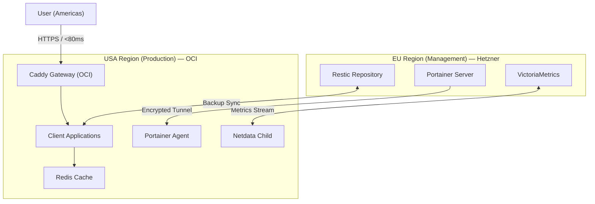

# The Hybrid Swarm Protocol (HSP)


> ⚠️ **SECURITY NOTICE — SANITIZATION IN PROGRESS**
>
> This **infrastructure reference architecture** powers the production environment of a **confidential client’s portfolio within the IT industry**.
>
> To protect client data and internal systems, the codebase is undergoing a **security audit** to remove:
> - Sensitive credentials  
> - `.env` files  
> - Proprietary logic  
>
> **Estimated public release:** **Q1 2026**  
> Until then, architecture documentation and sanitized technical snippets are provided below.

---

## 📖 Overview

The **Hybrid Swarm Protocol (HSP)** is a **split-horizon infrastructure reference architecture** designed to solve the classic **Latency vs. Sovereignty** dilemma in global DevOps.

It delivers a unified operations platform across multiple cloud providers **without**:
- Kubernetes federation (KubeFed)
- Cross-region consensus
- Expensive managed control planes

---

## ❗ The Problem

- **Hetzner (Germany)**
  - Exceptional pricing
  - Strong data sovereignty
  - High transatlantic latency (~200 ms)

- **Hyperscalers (AWS / OCI)**
  - Low-latency edge presence
  - High egress costs
  - Vendor lock-in

Stretching a single cluster across continents introduces instability, latency amplification, and operational fragility.

---

## ✅ The Solution: Split-Horizon Design

HSP implements a **bicephalic (two-headed) architecture**:

1. **Production Plane — “The Muscle”**
   - **Oracle Cloud Infrastructure (OCI)**
   - Region: Ashburn, USA
   - Architecture: ARM64 (Ampere)
   - Latency: `< 80 ms` to the Americas

2. **Management Plane — “The Brain”**
   - **Hetzner Cloud**
   - Region: Nuremberg, Germany
   - Architecture: x86
   - Responsibilities:
     - Backups
     - Monitoring
     - Governance
     - Control-plane services

Each plane operates independently but is centrally observed and governed.

---

## 🏗️ Architecture

Instead of a single fragile cluster stretched across the Atlantic, HSP uses **decoupled Docker Swarms**, managed through a centralized **Portainer** instance.



---

## 🧰 Technology Stack

* **Provisioning:** OpenTofu (Terraform fork)
* **Configuration Management:** Ansible (NIST-aligned hardening)
* **Orchestration:** Docker Swarm (High Availability)
* **Ingress:** Caddy (Automatic HTTPS, HTTP/3)
* **Networking:** WireGuard mesh

---

## 🛠️ Development Roadmap

This project follows an **Infrastructure-as-Product** lifecycle.

### Phase 1 — Architecture & Design ✅

* [x] Define split-horizon strategy (OCI vs. Hetzner)
* [x] Select *Arsenal 2026* stack (Swarm over Kubernetes)
* [x] Design network topology (Public IPs + WireGuard)

### Phase 2 — Provisioning (OpenTofu) ✅

* [x] Implement OCI provider (API key authentication)
* [x] Implement Hetzner Cloud provider
* [x] **Milestone:** Provisioned OCI ARM + Hetzner VPS via a single `tofu apply`
* [x] Configure remote state (S3-compatible backend)

### Phase 3 — Configuration (Ansible) ✅

* [x] Common baseline role (users, SSH hardening)
* [x] NIST 800-53 security controls (CrowdSec)
* [x] **Milestone:** Docker Engine configured on ARM64 and AMD64

### Phase 4 — Orchestration & GitOps ✅

* [x] Deploy Portainer Server (Management Plane)
* [x] Attach Production Plane via Portainer Agent
* [x] Enable label-driven ingress using Caddy

### Phase 5 — Public Release 🚧 *(Current Stage)*

* [ ] Audit git history (BFG Repo-Cleaner)
* [ ] Sanitize domains, IPs, and secrets
* [ ] Finalize public documentation
* [ ] Open-source release

---

## 💻 Technical Sneak Peek

Although the repository is currently private, the following snippets illustrate the hybrid control logic.

### OpenTofu — `main.tf` (Excerpt)

A single control file provisions infrastructure across continents.

```hcl
terraform {
  required_providers {
    oci    = { source = "oracle/oci" }
    hcloud = { source = "hetznercloud/hcloud" }
  }
}

# Production — OCI (USA)
resource "oci_core_instance" "production_node" {
  display_name        = "prod-us-ashburn-01"
  availability_domain = data.oci_identity_availability_domains.ads.availability_domains[0].name
  shape               = "VM.Standard.A1.Flex" # Ampere ARM

  shape_config {
    ocpus         = 4
    memory_in_gbs = 24
  }
}

# Management — Hetzner (Germany)
resource "hcloud_server" "management_node" {
  name        = "mgmt-de-nuremberg-01"
  server_type = "cax11"
  location    = "nbg1"
  image       = "debian-12"
}
```

---

### Caddy Ingress (Label-Driven)

Ingress is declared directly alongside the service definition.

```yaml
deploy:
  labels:
    caddy: "app.client-site.com"
    caddy.reverse_proxy: "{{upstreams 80}}"
    caddy.tls.email: "admin@example.com"
```

No ingress controllers.
No certificates to manage.
No glue code.

---

## 📬 Contact

**Maintained by:** Miguel Lozano — Cloud Infrastructure Engineer

* **Website:** [developmi.com](https://developmi.com)
* **Inquiries:** Please reach out via LinkedIn for architecture consulting

---

© 2025 Miguel Lozano. All rights reserved.